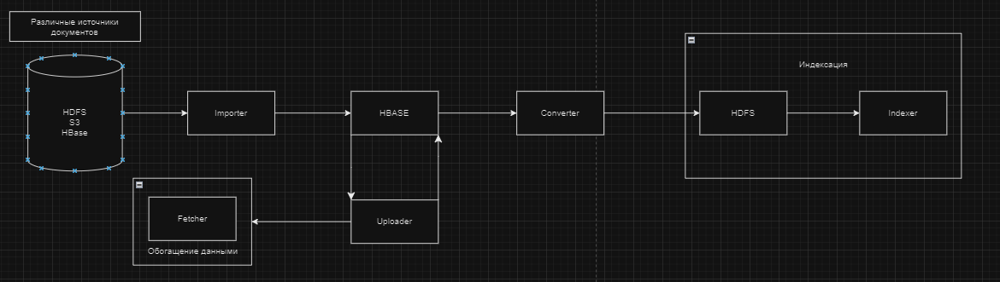
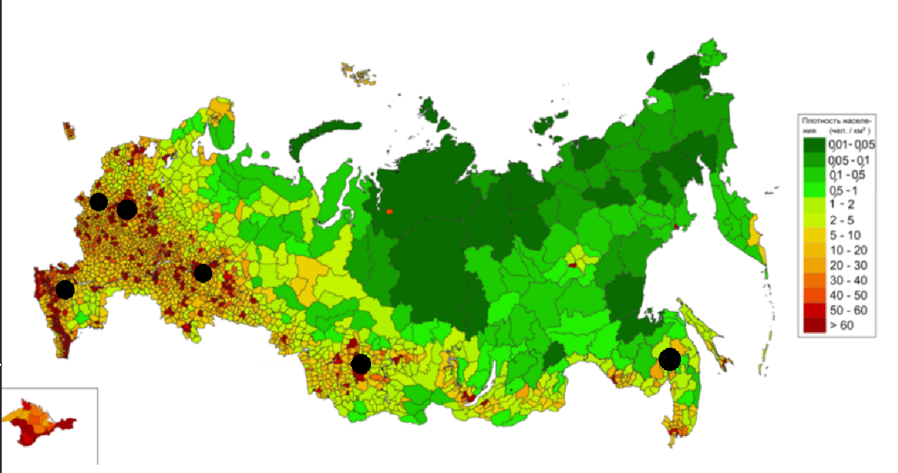
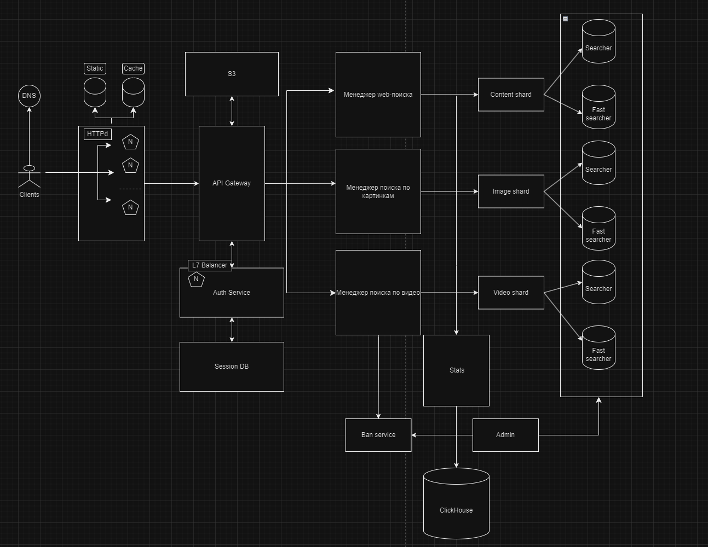
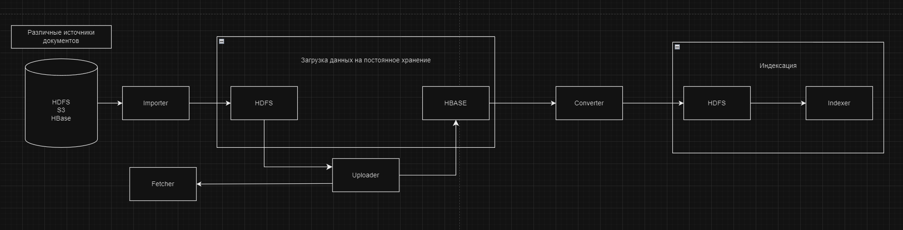

# Поиск
Highload course project

## 1. Тема и целевая аудитория
Поисковая система. Ориентирована на российский рынок.

### Аналоги
- Yandex поиск
- Google поиск
- Mail.ru поиск

### MVP
- Поиск по веб-сайтам
- Поиск по картинкам
- Поиск по видео

### Целевая аудитория
MAU 65.8 млн человек, DAU 26.6 млн человек

Распределение трафика по странам:

| Страна         | Доля пользователей, % |
|----------------|-----------------------|
| Россия         | 83.19                 |
| Нидерланды     | 7.1                   |
| Великобритания | 0.89                  |
| Казахстан      | 0.81                  |
| Грузия         | 0.79                  |
| Другие         | 7.23                  |

## 2. Расчет нагрузки
### Продуктовые метрики
| Метрика            | Значение, млн |
|--------------------|---------------|
| Общая аудитория    | 103.8         |
| Месячная аудитория | 65.8          |
| Дневная аудитория  | 26.6          |

#### Средний размер хранилища пользователя
Каждый пользователь хранит:
- Историю
- Закладки
- Аватар

Если пользователь в среднем совершает 36.92 поисков по веб сайтов + 15.38 поисков по картинкам + 
9.2 поисков по видео + хранение информации о пользователе(пример аватар ~ 1мб и краткую информацию аккаунта ~ 1мб) + 
закладки (в среднем у человека 30 закладок), то средний размер хранилища пользователя:

36.92*1Кб + 15.38*1Кб + 9.2*1Кб + 1024кб + 1024кб + 30*1Кб = 2Мб

#### Среднее количество действий пользователя по типам в день
| Действие            | Среднее кол-во в день на пользователя |
|---------------------|---------------------------------------|
| Поиск по веб-сайтам | 36.92                                 |
| Поиск по картинкам  | 15.38                                 |
| Поиск по видео      | 9.2                                   |

### Технические метрики
#### Размер хранения в разбивке по типам данных
Всего веб-сайтов: 1.97 млрд
Всего картинок в интернете 36 млрд
Всего видео: 200 млн

Хранить мы будем ссылки. Размер ссылки: 256 байт

| Тип данных | Размер, Тб |
|------------|------------|
| Ссылка     | 9.7        |

#### Сетевой трафик
Пиковое увеличение трафика примем в 2 раза
- Пиковое потребление в течении суток : 2 * 26.6 млн чел  * 11 стр * 6 Мб / 86400 сек = 40.6 Гбайт/сек = 325.1 Гбит/сек.
- веб-сайты: 26.6 млн чел * 11 стр * 7 Kб(средний вес странички с поиском в Яндекс поиске) = 1.9 Тб.
- изображения: 26.6 млн чел * 11 стр * 5 Мб(средний вес странички с поиском по картинкам в Яндекс поиске) = 1395.23 Тб.
- видео: 26.6 млн чел * 11 стр * 30 Мб(средний вес странички с поиском по видео в Яндекс поиске) = 8371.35 Тб.

| Техническая метрика                     | Значение        |
|-----------------------------------------|-----------------|
| Пиковое потребление в течении суток     | 325.1 Гбит/сек  |
| Суммарный суточный трафик - веб-сайты   | 1.9 Тб/сек      |
| Суммарный суточный трафик - изображения | 1395.23 Тб/сек  |
| Суммарный суточный трафик - видео       | 8371.35 Тб/сек  |

#### RPS в разбивке по типам запросов.
Всего поисковых запросов в день: 1.6 млрд
Формула: Всего запросов * процент поиска во веб-сайтам / время

| Запрос              | RPS   |
|---------------------|-------|
| Пиковый RPS         | 37038 |
| Поиск по веб-сайтам | 11112 |
| Поиск по картинкам  | 4630  |
| Поиск по видео      | 2778  |

# 3. Глобальная балансировка
## 3.1 Расположение

Так как Поиск нацелен в первую очередь на рынок РФ, то сервера будут распологаться только в данной стране.
Рассмотрим плотность людей по регионам в РФ[^1]. Из данной статистики можно сказать, что целесобразно будет размещать сервера в Центральной части России, Южной части, Уральской части на юге, Приволжской части, а также в Дальневостойчной на юге[^2].

Из статистики плотности населения сервера нужно дополнительно разместить в Москве и Санкт-Петербурге, так как там проживают значительная часть населения.
## 3.2 Балансировка
Балансировка между различными частями России будет осуществляться по принципу DNS. Внутри этих частей балансировка осуществляется по принципу BGP Anycast. Совмещенно данные технологии помогут распределять нагрузку на ближайшие к пользователю сервера.
## 3.3 Итоговое покрытие
В итоге получилось 8 серверов для доступа к нашим сервисам. На карте показано распределение нагрузки на каждый дата центр.

# 4. Локальная балансировка нагрузки
Будет организована балансировка при помощи L7 балансировщика, который позволит просматривать конкретные протоколы, а также ставить timeout и следить за падениями определенных серверов.
А также позволяет поддерживать постоянное соединение, что уберет задержку при отправке запросов.

Балансировщики будут расположены с использованием VRRP, чтобы при выключении балансировщика включался запасной балансировщик.
На роль L7 балансировщика выбран Envoy, так как он быстрее работает с HTTPS, обрабатывает больше запросов, а также поддерживает динамическое изменение конфигурации по gRPC.

Отказоустойчивости можно добиться с помощью Keepalived, который будет обеспечивать доступность сервиса даже при отказе отдельных узлов

Для обеспечения SSL-сертификации используем Let’s Encrypt. 
Для улучшения производительности Session Cache.

Также на уровне сети можно применить NGINX.

# 5. Логическая схема БД

База данных для системы поиска должна быть структурированной и содержать информацию, необходимую для эффективного поиска и предоставления результатов пользователю. Она может включать следующие элементы:

1. Таблица с данными о документах: содержит информацию о каждом документе, такую как заголовок, описание, автор, дата публикации и т. д.

2. Таблица с данными о ключевых словах: содержит список ключевых слов или тегов, связанных с каждым документом. Это позволяет пользователям использовать ключевые слова при поиске и получать соответствующие результаты.

3. Таблица с данными о категориях: содержит информацию о категориях или тематических областях, к которым относятся документы. Это позволяет пользователям фильтровать результаты по категориям.

4. Таблица с данными о пользователях: содержит информацию о зарегистрированных пользователях системы поиска, такую как имя, адрес электронной почты, пароль и т. д.

5. Таблица с данными о запросах пользователей: содержит информацию о запросах, отправленных пользователями системы поиска, включая текст запроса, дату и время отправки и т. д.

6. Таблица с данными о результатах поиска: содержит информацию о результатах поиска для каждого запроса, включая идентификатор запроса, идентификаторы найденных документов и т. д.

7. Таблица с данными об объекте поиска: содержит информацию о конкретном объекте

Кроме того, база данных может содержать другие таблицы или дополнительные поля, в зависимости от конкретных требований системы поиска.
## Расчёт занимаемого дискового пространства

Посчитаем, сколько за год потребуется дополнительной памяти.

**Типы данных в БД:**
- varchar(x) - X Б
- boolean - 1 Б
- bytea - 32 Б
- int - 4 Б
- bigint - 8 Б
- timestamp - 8 Б
- double - 8 Б

Таблица Documents(1 запись): id(bigint)8Б + title(varchar(255))255Б + description(varchar(255))255Б + author(varchar(255))255Б + date(timestamp)8Б + link(varchar(255))255Б = 1036Б
Таблица KeyWords(1 запись): 271Б
Таблица Users(1 запись): 773Б
Таблица UsersQuery(1 запись): 534Б
Таблица SearchResults(1 запись): 24Б
Таблица Category(1 запись): 263Б
Таблица Sessions(1 запись): 48Б
Таблица Objects(1 запись): ?

# 6. Физическая схема БД
## Индексы
**Documents:** b-tree(id)(P_KEY), hash(author), b-tree(link)
title + description + type индексируются в поисковом движке (sphinx)

**KeyWords:** b-tree(id)(P_KEY)

**User:** b-tree(id)(P_KEY)

**UsersQuery:** b-tree(id)(P_KEY), hash(user_id), hash(document_id)

**SearchResults:** b-tree(id)(P_KEY), hash(query_id), hash(document_id)

**Categories:** b-tree(id)(P_KEY)

**Sessions:** b-tree(id)(P_KEY), hash(user_id)

**Objects:** b-tree(id)(P_KEY)

## Денормализация
- Фотографии пользователей в СУБД могут храниться в виде массива из ссылок в s3
- Данные о поисковых объектах также хранятся в s3
## СУБД
- Users - Postgresql
- Categories - Postgresql
- Documents - S3/HDFS
- UsersQuery - Kafka
- Sessions - Redis
- KeyWords - Postgresql
- SearchResults - Kafka
- Objects - Postgresql

## Балансировка запросов
### Шардирование
Шардирование имеет смысл делать для таблиц "Documents" исходя из ее размеров
Таблицу "Documents" можно шардировать по алгоритму key-based шардинг.

### Репликация
Каждая база данных будет иметь 3 реплики.
В master - запись, slave - чтение.
Это позволит надежно хранить данные и иметь достаточную скорость доступа к данным.

### Производительность
Для увеличения производительности работы бд необходимо работать с бд в ограниченное число коннектов от каждого из бэкендов.

## Клиентские библиотеки
Основной язык бэкенда - Go, поэтому рассмотрим коннекторы для него

- Postgres - pgx (лучший по бенчмаркам и позволяет настраивать кол-во коннектов к бд)
- Tarantool - [официальный драйвер от разработчиков](https://github.com/tarantool/go-tarantool)
- Redis - [официальный драйвер от разработчиков](https://github.com/redis/go-redis)(лучший по бенчмаркам и лучший по качеству поддержки)
- Amazon S3 - aws-sdk-go (официальный SDK Amazon Web Services (AWS) для Go. Позволяет работать с Amazon S3 и выполнять операции с бакетами, объектами, доступами и другими функциональностями S3)

# 7. Распределенные алгоритмы
## Сканирование ресурсов
Сканирование может быть описано, как автоматизированный процесс систематического изучения общедоступных страниц в Интернете.
Во время этого процесса поисковая система обнаруживает новые или обновленные страницы и добавляет их в свою базу.
Для облегчения работы он использует специальную программу.
Боты посещают список URL-адресов, полученных в процессе прошлого сканирования и дополненных данными карты сайта, которую предоставляют веб-мастера и анализируют их содержание.
При обнаружении ссылок на другие страницы во время посещения сайта, боты также добавляют их в свой список и устанавливают систематические связи.
Процесс сканирования происходит на регулярной основе в целях выявления изменений, изъятия «мертвых» ссылок и установления новых взаимосвязей.

## Индексация
Процесс сохранения полученной информации в базе данных в соответствии с различными факторами для последующего извлечения информации.
Ключевые слова на странице, их расположение, мета-теги и ссылки представляют особый интерес для индексации.
Основная цель процесса индексации: быстро реагировать на поисковой запрос пользователя.

## Рекомендованные ресурсы
Когда пользователь вводит запрос, поисковая система производит в базе данных поиск, подходящий под условия и алгоритмически определяет актуальность содержания, что выводит к определенному рейтингу среди найденных сайтов.
Логично, что результаты, которые считаются более релевантными для пользователя поисковой системы, намеренно получают более высокий ранг, чем результаты, которые имеют меньше шансов обеспечить адекватный ответ.

# 8. Технологии
## Брокер сообщений
Все запросы пользователей будут изначально складываться в очередь.
А сервер, когда освободится от прошлой задачи, сам «придет» к очереди и заберет оттуда новый запрос.
В итоге тот сервер, что слабее, будет просто обращаться к очереди реже и работать в комфортном темпе.
А более мощный — быстрее справляться с задачами и брать новые запросы чаще.

В качестве брокера сообщений выберем Apache Kafka.

## БД и кеш
В качестве СУБД будет использоваться PostgreSQL, а для хранения сессий будет использоваться Redis(причины описывались выше)

## Хранилище медиа
Для хранения медиа контента будет использоваться Amazon S3. 
Amazon s3 обеспечивает высокий уровень безопасности, предоставляет возможность управлять доступом с помощью средств авторизации и аутентификации.
Также он предоставляет репликацию данных в разных регионах, автоматическое шифрование данных, журналирование, управление версиями файлов. 
Может автоматически масштабироваться, чтобы удовлетворить даже самые высокие требования к хранению данных.

## Балансировщик
Envoy - балансировщик, reverse proxy (причины описывались выше)

## Метрики
Grafana - для визуализации графиков, мониторинга, принятия бизнес-решений и алертов

# 9. Схема

# 10. Обеспечение надежности

## Аварийное переключение
 - Повторение запросов для повышения вероятности успешной обработки
 - Уменьшение количества запросов в случае недоступности какого-либо сервиса
 - Отдавать пользователю всю доступную информацию, вместо всей, в случае если часть информации недоступна
 - Расчеты пикового трафика и вместимость хранилица 

## Резервирование
- резервирование серверов, дисков и другого оборудования
- резервирование CDN серверов, которые смогут обслужить систему в случае отказа основного сервера
- резервные копии файлов в s3

## БД отказоустойчивость
- Резервное копирование
- Снапшоты и логи для восстановления операций
- Реплецирование
- Шардирование

## K8s
- Оркестратор масштабирует сервисы, исходя из текущей нагрузки
- Для быстрого устранения ошибки - удобный откат
- Единое управление всеми узлами

## Асинхронные паттерны
- CQRS для разделения операция записи/чтения
- Событийно ориентированная архитектура

## Список литературы
[^1]: [Плотность населения РФ](https://www.statdata.ru/karta/plotnost-naseleniya-rossii)
[^2]: [Округа РФ](https://secretmag.ru/enciklopediya/federalnye-okruga.htm)
